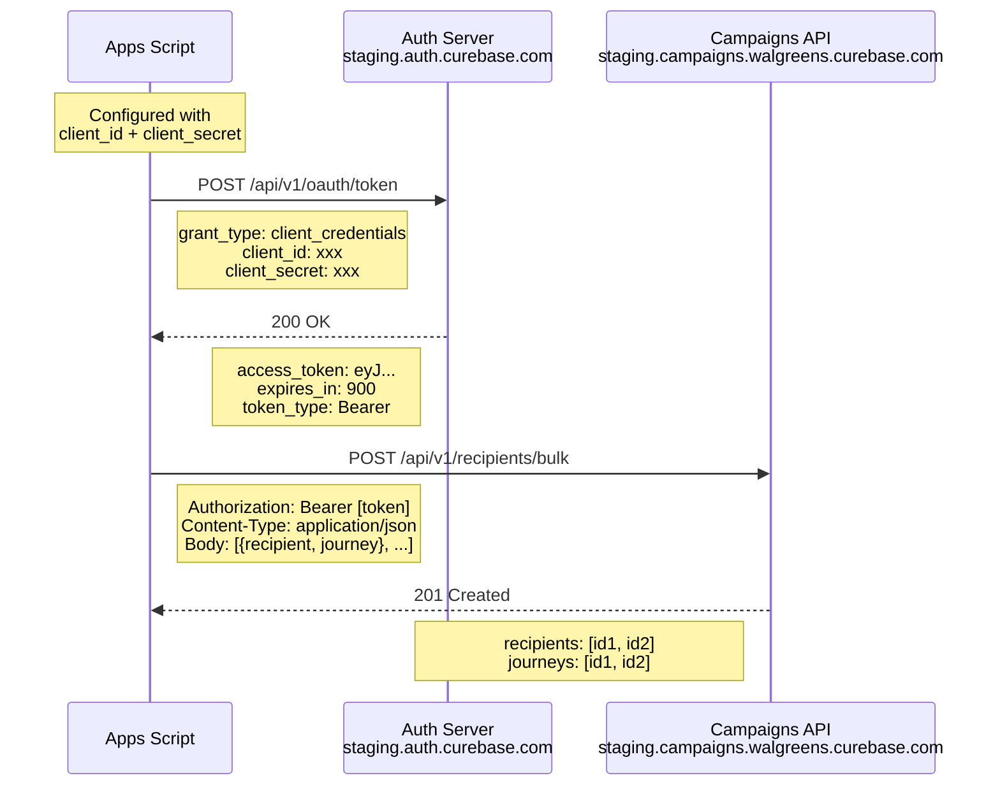
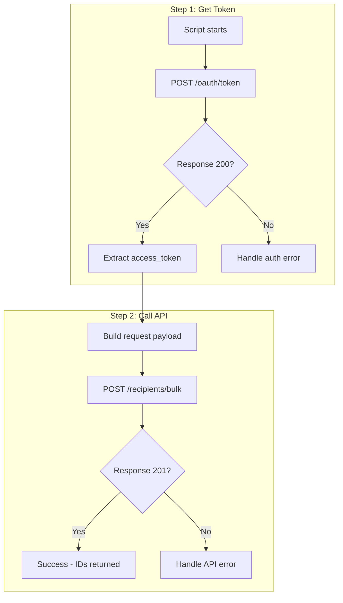
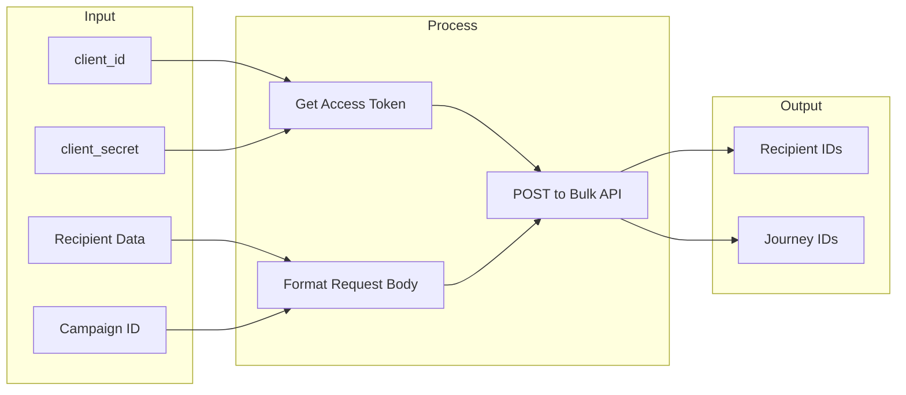

# Campaign API Authentication Flow

## Ideal Authentication & API Flow



## Request/Response Flow



## Data Flow



---

## Required Credentials

| Item | Description | Where to Get |
|------|-------------|--------------|
| `client_id` | OAuth client identifier | Request from platform team |
| `client_secret` | OAuth client secret | Request from platform team |
| `campaignId` | Target campaign for journeys | From Campaigns UI or GET /api/v1/campaigns |

## API Endpoints

| Purpose | Method | URL |
|---------|--------|-----|
| Get Token | POST | `https://staging.auth.curebase.com/api/v1/oauth/token` |
| Bulk Recipients | POST | `https://staging.campaigns.walgreens.curebase.com/api/v1/recipients/bulk` |

## Request Body Schema (Bulk Recipients)

```json
[
  {
    "recipient": {
      "customerId": "required-external-id",
      "email": "user@example.com",
      "firstName": "First",
      "lastName": "Last",
      "phone": "+15551234567",
      "status": "ACTIVE",
      "tags": ["tag1", "tag2"],
      "communicationPreferences": {
        "optIn": true
      }
    },
    "journey": {
      "campaignId": "required-campaign-id",
      "status": "NOT_STARTED"
    }
  }
]
```

